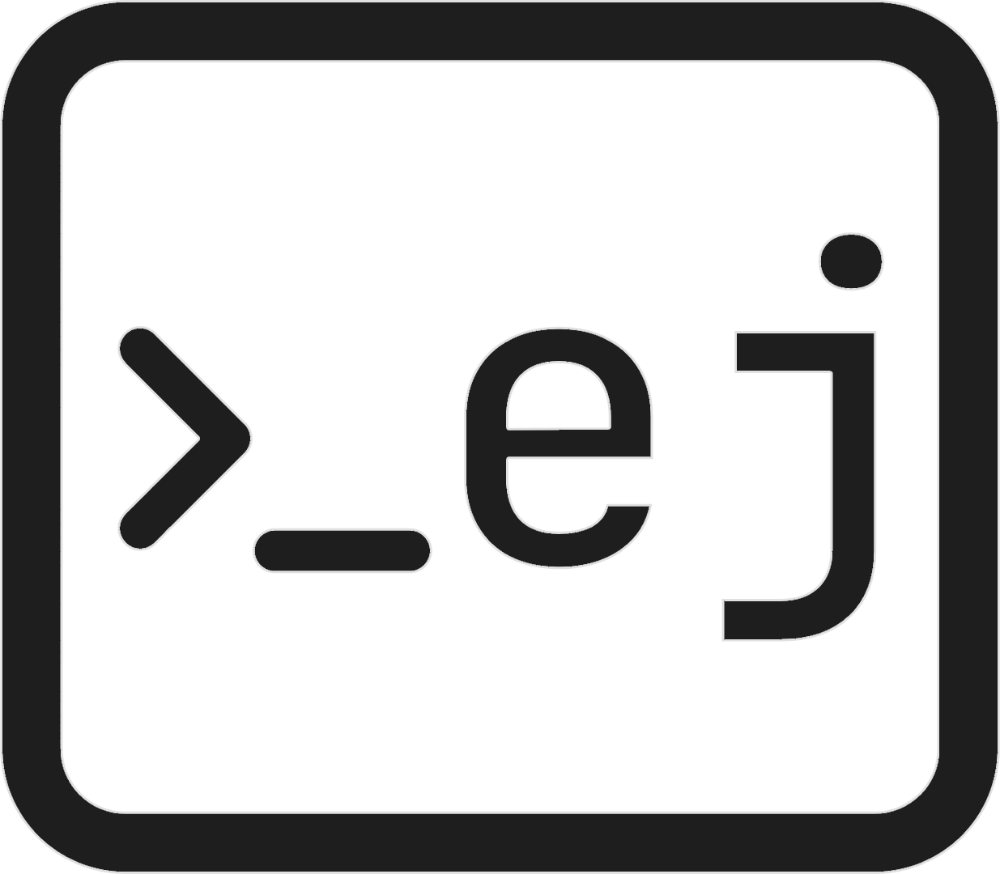

# ejustian-cli

<p align="center">
    
</p>

[](https://python.org/)
[](https://opensource.org/licenses/MIT)
[](https://github.com/Abdelrahman0W/ejustian-cli/actions/workflows/python-package.yml)
[](https://github.com/Abdelrahman0W/ejustian-cli/actions/workflows/codeql.yml)


- [ejustian-cli](#ejustian-cli)
  - [Description](#description)
  - [Dependencies](#dependencies)
  - [Installation](#installation)
    - [Method 1](#method-1-direct-installation)
    - [Method 2](#method-2-clone-and-install-manually)
  - [Usage](#usage)
  - [Features](#features)
  - [Contributors](#contributors)

## Description

A command line interface app that allows EJUST students to manage all their stuff.

## Dependencies

- Python>=3.8.* ([Installation Guide](https://docs.python.org/3/using/index.html))
- pip>=20.0.* ([Installation Guide](https://pip.pypa.io/en/stable/installation/))

## Installation

### Method 1: Install Using PIP

```shell
pip install ejustian-cli
```

### Method 2: Clone and Install Manually

```shell
pip install git+https://github.com/Abdelrahman0W/ejustian-cli.git
```

1. Clone this repo

    ```shell
    git clone https://github.com/Abdelrahman0W/ejustian-cli.git
    ```
1. Change directory

    ```shell
    cd ejustian-cli
    ```
1. Install using `pip`

    ```shell
    pip install .
    ```

## Usage

To use the app use the following command in your terminal

```shell
ej
```

## Features

> Current Features are checked

- [X] Scrape SIS Data
  - [X] Name
  - [X] ID
  - [X] Faculty
  - [X] Degree
  - [X] Major
  - [X] Level
  - [X] Enrollment Status
  - [X] Academic Status
  - [X] Total Passed CH
  - [X] Remaining CH
  - [X] CGPA
- [X] Attendance Tracker
- [X] Personal Attendance Tracker
- [X] Show Student Advisor
- [X] Task Manager (Kanban Style)
- [X] E-JUST Map
- [X] Connect to Nearest WiFi
- [X] Show Student Schedule
- [X] Export Student Schedule to PDF
- [X] Export Student Schedule to Calendar
- [ ] Google Classroom CLI
  - [ ] Join a Class
  - [ ] Show TO-DO
  - [ ] Show Classes
  - [ ] Submit Assignment
  - [ ] Check Grades
  - [ ] Check Assignment Grade
  - [ ] Show Class Materials
  - [ ] Show Class Posts
- [ ] Useful Emails
- [ ] All '@ejust.edu.eg' Emails
- [ ] In-Lecture Note Taking
- [ ] Course Grade Tracker
- [ ] Personal Vault
- [ ] Resume Builder
- [ ] Resume Scanner
- [ ] Resume ATS Checker
- [ ] Internships Checker
- [ ] Services in Borg El-Arab
- [ ] Built-In Mailer

## Contributors

|||||
|:-:|:-:|:-:|:-:|
|[**Maria Gamal**](https://github.com/MariaGamal)|[**Abdelrahman Wael**](https://github.com/Abdelrahman0W)|[**Tameem Alaa**](https://github.com/tameemalaa)|[**Abdelrahman Nawar**](https://github.com/Nawarrr)|
